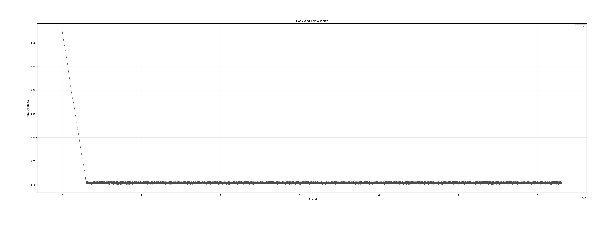
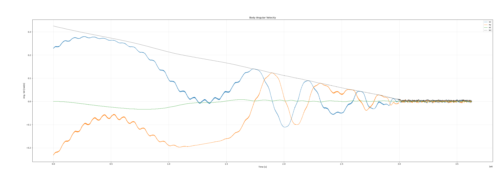
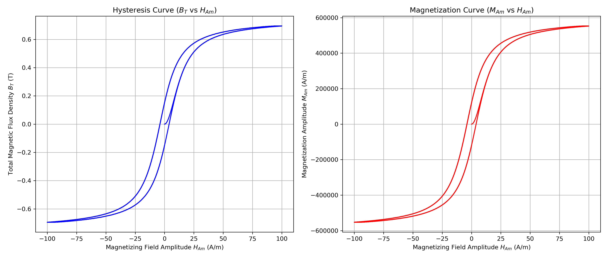

# Attitude Orbit Simulator for Passive AOCS

This project is a simulator designed to predict the attitude dynamics of a CubeSat using a passive Attitude and Orbit Control System (AOCS). It models the complex interaction between a permanent magnet, hysteresis damping rods, and the Earth's environment to simulate detumbling and magnetic stabilization in Low Earth Orbit (LEO).

## Core Physics Models

### 1. Environmental Modeling (GeographicLib)
*   **Gravity:** **EGM2008** (Earth Gravitational Model) calculates gravitational perturbations (J2, etc.).
*   **Magnetosphere:** **WMM2025** (World Magnetic Model) provides the precise magnetic field vector $\mathbf{B}(t, \mathbf{r})$ at the satellite's specific geodetic location and epoch.

### 2. Rotational Dynamics
The angular acceleration is driven by external torques balanced against the spacecraft's inertia and gyroscopic coupling:

$$
\frac{d\boldsymbol{\omega}}{dt} = \mathbf{I}^{-1} \left[ \mathbf{m}_p \times \mathbf{B}_{body} + \sum_{i=1}^{N} \mathbf{T}_{h,i} + \boldsymbol{\tau}_{grav} - \boldsymbol{\omega} \times (\mathbf{I}\boldsymbol{\omega}) \right]
$$

### 3. Hysteresis Damping (Jiles–Atherton)
Passive damping is achieved via soft magnetic rods that dissipate energy through magnetic hysteresis. This is modeled using the **Jiles–Atherton** differential equation. The solver computes the time derivative of magnetization $\dot{M}$ by applying the chain rule to the field variations experienced by the tumbling craft:

$$
\frac{dM}{dt} = \frac{dM}{dH} \cdot \left( \frac{d\mathbf{B}_{body}}{dt} \cdot \frac{\mathbf{u}_{rod}}{\mu_0} \right)
$$

## Configuration & CLI Options

The simulation is configured via command-line arguments.

### Spacecraft Parameters
*   `--mass`: Spacecraft mass **[g]**.
*   `--width`, `--height`, `--length`: Dimensions **[m]**.
*   `--magnet-remanence`: Residual flux density ($B_r$) **[T]**.
*   `--magnet-diameter`, `--magnet-length`: Permanent magnet dimensions **[m]**.
*   `--rod-volume`: Volume of individual hysteresis rods **[m³]**.
*   `--rod-orientation`: Direction vectors for rods (e.g., `1,0,0`). Can be used multiple times for multiple rods.

### Orbit Parameters (Keplerian)
*   `--orbit-semi-major-axis`: Semi-major axis ($a$) **[m]**.
*   `--orbit-eccentricity`: Orbit eccentricity ($e$) [0-1].
*   `--orbit-inclination`: Inclination ($i$) **[rad]**.
*   `--orbit-raan`: Right Ascension of Ascending Node **[rad]**.
*   `--orbit-arg-periapsis`: Argument of Periapsis **[rad]**.
*   `--orbit-mean-anomaly`: Mean Anomaly **[rad]**.

### Hysteresis Material (Jiles-Atherton)
*   `--hysteresis-ms`: Saturation Magnetization ($M_s$) **[A/m]**.
*   `--hysteresis-k`: Pinning energy density ($k$) **[A/m]**.
*   `--hysteresis-a`: Anhysteretic shape parameter ($a$) **[A/m]**.
*   `--hysteresis-c`: Reversibility coefficient ($c$) [0-1].
*   `--hysteresis-alpha`: Inter-domain coupling ($\alpha$).

### Simulation Control
*   `--simulation-year`: Decimal year for magnetic model epoch (e.g., `2025.0`).
*   `--gravity-model-degree`: Degree of the harmonic gravity model (e.g., 2 for J2, 12 for high precision).
*   `--t-end`: Simulation end time **[s]**.
*   `--dt`: Initial time step **[s]**.
*   `--checkpoint-interval`: Interval to save state snapshots **[s]** (reduces output size for long sims).
*   `--higher-order`: Enable Runge-Kutta-Fehlberg 7/8 solver.

## Example Usage

### 1. Long-Duration Simulation (2 Years)
This configuration simulates a 1U CubeSat (1.3kg) with HyMu-80 rods over a 2-year period. It uses a checkpoint interval of 600s to keep the output file manageable.

```bash
./build/attitude_orbit_simulator \
    --output simulation_2year.csv \
    --mass 1300 \
    --width 0.1 --height 0.1 --length 0.1 \
    --magnet-remanence 1.2 \
    --magnet-diameter 0.005 --magnet-length 0.020 \
    --rod-volume 8.0e-8 \
    --rod-orientation 1,0,0 \
    --rod-orientation -1,0,0 \
    --rod-orientation 0,1,0 \
    --rod-orientation 0,-1,0 \
    --hysteresis-ms 600000 \
    --hysteresis-a 8.0 \
    --hysteresis-k 4.0 \
    --hysteresis-c 0.05 \
    --hysteresis-alpha 1.0e-5 \
    --orbit-semi-major-axis 6818000 \
    --orbit-inclination 1.3963 \
    --orbit-eccentricity 0.001 \
    --angular-velocity 0.23,-0.23,0 \
    --simulation-year 2025.0 \
    --t-end 63072000 \
    --dt 0.1 \
    --checkpoint-interval 600 \
    --gravity-model-degree 12
```

### 2. Material Verification
Generate a hysteresis loop curve to verify the physics model corresponds to the specific material datasheet (e.g., HyMu-80) before running a full simulation.

```bash
./build/attitude_orbit_simulator \
    --verify-hysteresis \
    --output hymu80_curve.csv \
    --hysteresis-ms 600000 \
    --hysteresis-k 4.0 \
    --hysteresis-a 8.0 \
    --hysteresis-c 0.05 \
    --hysteresis-alpha 1.0e-5
```

## Results

### Orbit Visualization
A 7200-second validation of the orbital propagator using EGM2008 gravity (Degree 12).


### Detumbling Phase (First 2 Weeks)

> NOTE: This is different simulation

The initial high angular velocity (tumble) is dissipated by the hysteresis rods. The "envelope decay" behavior is clearly visible as energy is removed from the system.


### Magnetic Lock (2 Year Overview)
Over the full mission duration, the satellite settles into a magnetic lock (oscillating at $2\times$ orbital rate). The "Settling Time" for this configuration was approximately **4.8 weeks**.


#### Detumbling Phase (First 6 weeks)



### Magnetization Dynamics
The internal state of the hysteresis rods ($M$) responding to the changing $B$-field in the body frame during the detumbling phase.


### Material Characterization
Verification of the Jiles-Atherton implementation for **HyMu-80 Permalloy**. This curve validates that the rods saturate correctly ($\approx 600,000$ A/m) and exhibit the expected coercivity.


## Dependencies

*   **C++20** compliant compiler
*   **Boost** (Program Options, ODEint)
*   **Eigen3** (Linear Algebra)
*   **GeographicLib** (Gravity and Magnetic field models)
