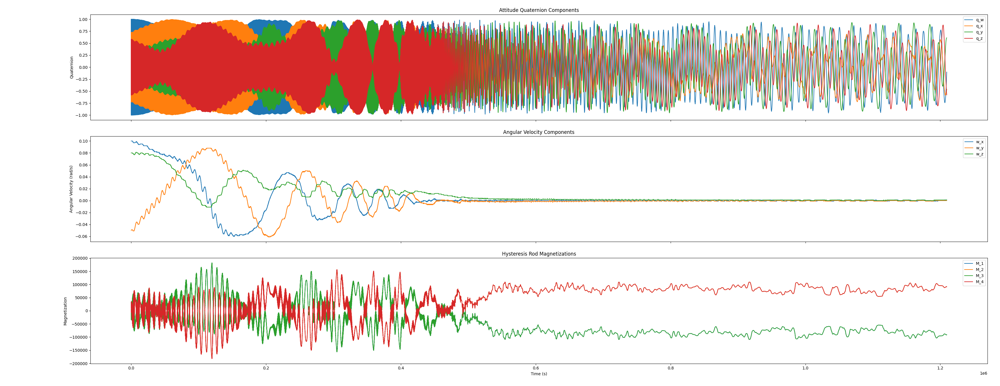
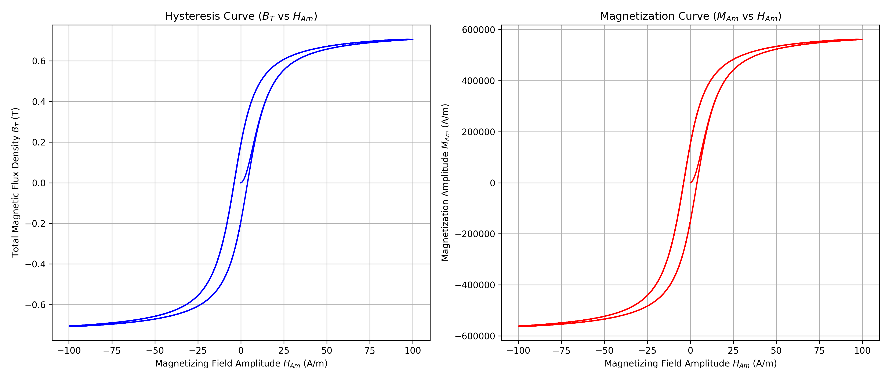

# Attitude Orbit Simulator for Passive AOCS

This project is a simulator designed to predict the attitude dynamics of a spacecraft using a passive Attitude and Orbit Control System (AOCS). It models the interaction between a permanent magnet, hysteresis damping rods, and the Earth's geomagnetic field to simulate the detumble and final stabilization of a satellite in Low Earth Orbit (LEO).

## Core Physics Models

The simulation is built on a foundation of key differential equations that govern the spacecraft's rotational motion. The primary goal is to solve for the time evolution of the spacecraft's angular velocity ($\boldsymbol{\omega}$) and its attitude, represented by a unit quaternion ($\mathbf{q}$).

### Rotational Dynamics

The change in angular velocity is driven by external magnetic torques from the permanent magnet and hysteresis rods, balanced against the spacecraft's own gyroscopic inertia.

$$
\frac{d\boldsymbol{\omega}}{dt} = \mathbf{I}^{-1} \left[ \mathbf{m}_p \times \mathbf{B}(t) + \sum_{i=1}^{N} \mathbf{T}_{h,i}(t) - \boldsymbol{\omega} \times (\mathbf{I}\boldsymbol{\omega}) \right]
$$

### Attitude Kinematics

The orientation of the spacecraft changes based on its current angular velocity, governed by the quaternion kinematics equation.

$$
\frac{d\mathbf{q}}{dt} = \frac{1}{2} \mathbf{\Omega}(\boldsymbol{\omega}) \mathbf{q}, \quad \text{where} \quad
\mathbf{\Omega}(\boldsymbol{\omega}) =
\begin{bmatrix}
0 & -\omega_x & -\omega_y & -\omega_z \\
\omega_x & 0 & \omega_z & -\omega_y \\
\omega_y & -\omega_z & 0 & \omega_x \\
\omega_z & \omega_y & -\omega_x & 0
\end{bmatrix}
$$

## Inputs & Configuration

```
THIS SECTION IS TODO
```

The simulation is configured via a `.ini` file, allowing for easy modification of the scenario. Key inputs include:

*   **Spacecraft Physical Properties:**
    *   Mass and dimensions (for inertia tensor calculation).
    *   Permanent magnet properties (material grade, dimensions, body-fixed orientation).
    *   Hysteresis rod properties (material, volume, body-fixed orientations).
*   **Initial Conditions:**
    *   Initial angular velocity (the "tumble").
    *   Initial attitude quaternion.
*   **Orbital Parameters:**
    *   Circular orbit altitude and inclination.
*   **Simulation Control:**
    *   Start and end times.
    *   Initial time step for the adaptive integrator.

## Outputs

The primary output is a CSV data file containing the time history of the spacecraft's state vector. The columns include:
*   `time`
*   `q_w, q_x, q_y, q_z` (Attitude Quaternion components)
*   `w_x, w_y, w_z` (Angular Velocity components in rad/s)
*   `M_1, M_2, ...` (Internal magnetization of each hysteresis rod in A/m)

This data is used to generate plots for analysis and verification.

## Example Result & Conclusion

The plot below shows the result of a 2-week simulation of a 1U CubeSat with an initial tumble.



The plot below shows the result of a calculation of a sample material hysteresis curve:



**Conclusion:**

The simulation successfully models the complete behavior of the passive AOCS.

1.  **Detumble Phase:** The initial high angular velocity is effectively damped by the hysteresis rods, with the majority of the rotational energy dissipated within the first week.
2.  **Stabilization Phase:** As the angular velocity approaches zero, the permanent magnet aligns the spacecraft with the local geomagnetic field.
3.  **Final State:** The spacecraft's permanent magnet continuously tracks the changing direction of the Earth's magnetic field as it orbits, resulting in small, periodic oscillations in attitude and angular velocity.
