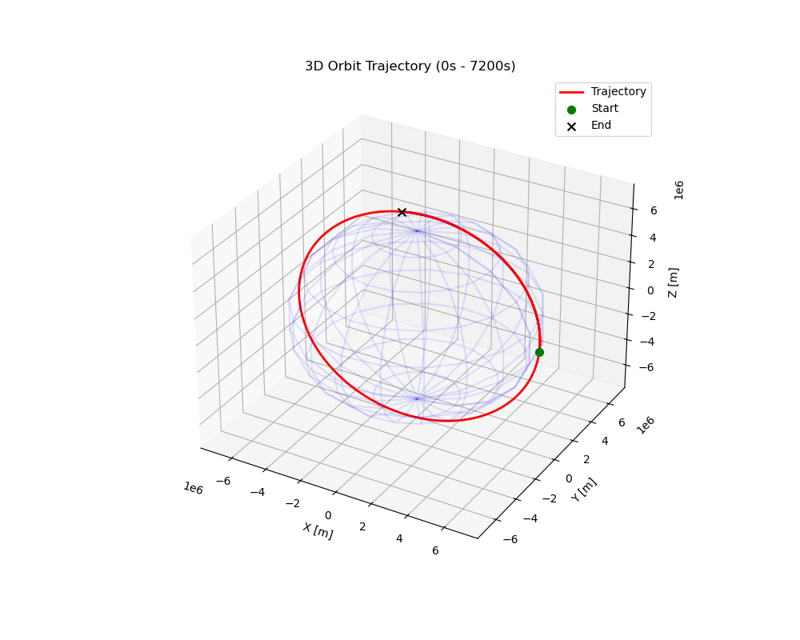
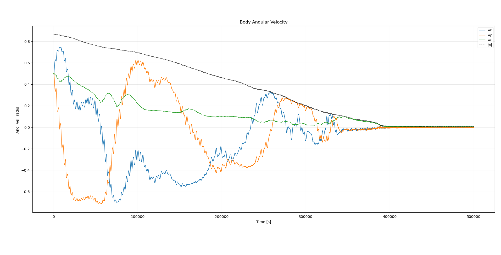
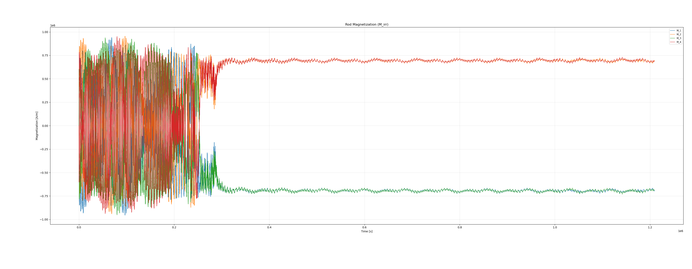
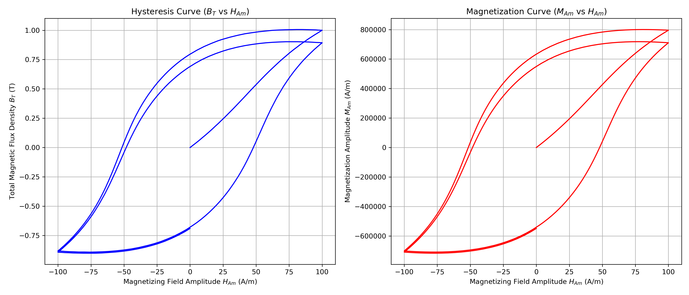

# Attitude Orbit Simulator for Passive AOCS

This project is designed to predict the attitude dynamics of a CubeSat using a passive Attitude and Orbit Control System (AOCS). It models the interaction between a permanent magnet, hysteresis damping rods, and the Earth's environment to simulate the detumble and stabilization phases in Low Earth Orbit (LEO).

## Mission Context & Deorbit Compliance

This simulator is specifically tuned for long-duration missions (e.g., **2 years**). Understanding the passive equilibrium attitude is critical for drag analysis and ensuring compliance with Space Debris Mitigation Guidelines for post-mission disposal.

## Core Physics Models

The simulation integrates orbital mechanics, environmental modeling, and rigid body dynamics to solve for the time evolution of the spacecraft's angular velocity ($\boldsymbol{\omega}$) and attitude quaternion ($\mathbf{q}$).

### 1. Environmental Modeling (GeographicLib)
Unlike simple dipole models, this simulator uses high-precision environmental data:
*   **Gravity:** **EGM2008** (Earth Gravitational Model) is used to calculate gravitational perturbations (J2, etc.) affecting the orbit.
*   **Magnetosphere:** **WMM2025** (World Magnetic Model) provides the precise magnetic field vector $\mathbf{B}(t, \mathbf{r})$ at the satellite's specific geodetic location and epoch.

### 2. Rotational Dynamics
The angular acceleration is driven by external torques balanced against the spacecraft's inertia and gyroscopic coupling:

$$
\frac{d\boldsymbol{\omega}}{dt} = \mathbf{I}^{-1} \left[ \mathbf{m}_p \times \mathbf{B}_{body} + \sum_{i=1}^{N} \mathbf{T}_{h,i} + \boldsymbol{\tau}_{grav} - \boldsymbol{\omega} \times (\mathbf{I}\boldsymbol{\omega}) \right]
$$

Where:
*   $\mathbf{m}_p$: Dipole moment of the permanent magnet.
*   $\mathbf{T}_{h,i}$: Torque from hysteresis rod $i$.
*   $\boldsymbol{\tau}_{grav}$: Gravity gradient torque.

### 3. Hysteresis Damping (Jiles–Atherton)
Passive damping is achieved via soft magnetic rods that dissipate energy through magnetic hysteresis. This is modeled using the **Jiles–Atherton** differential equation, solved dynamically alongside the attitude state.

The solver computes the time derivative of magnetization $\dot{M}$ by applying the chain rule to the field variations experienced by the tumbling craft:

$$
\frac{dM}{dt} = \frac{dM}{dH} \cdot \left( \frac{d\mathbf{B}_{body}}{dt} \cdot \frac{\mathbf{u}_{rod}}{\mu_0} \right)
$$

## Inputs & Configuration

The simulation is configured via command-line arguments. All units are **SI** (Meters, Kilograms, Seconds, Radians, Tesla, A/m) unless otherwise specified.

### Spacecraft Properties
*   `--mass`: Mass in grams.
*   `--width`, `--height`, `--length`: Dimensions in meters.
*   `--magnet-remanence`: Residual flux density ($B_r$) in Tesla.
*   `--rod-volume`: Volume of individual hysteresis rods ($m^3$).
*   `--rod-orientation`: Direction vectors for rods (e.g., `1,0,0`).

### Orbit Initialization (Keplerian Elements)
*   `--orbit-semi-major-axis`: Semi-major axis ($a$) in meters.
*   `--orbit-eccentricity`: Orbit eccentricity ($e$).
*   `--orbit-inclination`: Inclination ($i$) in radians.
*   `--orbit-raan`: Right Ascension of Ascending Node ($\Omega$) in radians.
*   `--orbit-arg-periapsis`: Argument of Periapsis ($\omega$) in radians.
*   `--orbit-mean-anomaly`: Mean Anomaly ($M$) in radians.

### Simulation Control
*   `--simulation-year`: Decimal year for magnetic model epoch (e.g., `2025.5`).
*   `--t-end`: Total simulation duration in seconds.
*   `--higher-order`: Enable Runge-Kutta-Fehlberg 7/8 solver (default is Dormand-Prince 5).

## Example Usage

### 1. Standard Simulation
Simulate a standard ISS-like orbit (approx 400km altitude, 51.6° inclination) for 2 days.

*Note: Inputs must be in SI units. 400km Altitude $\approx$ 6778000m Semi-Major Axis. 51.6° $\approx$ 0.900 radians.*

```sh
./build/attitude_orbit_simulator \
    --output results.csv \
    --mass 1300 \
    --width 0.1 --height 0.1 --length 0.1 \
    --magnet-remanence 1.1 \
    --magnet-diameter 0.005 --magnet-length 0.02 \
    --rod-volume 3.0e-7 \
    --rod-orientation 1,0,0 --rod-orientation 0,1,0 \
    --orbit-semi-major-axis 6778000 \
    --orbit-inclination 0.9006 \
    --orbit-eccentricity 0.001 \
    --angular-velocity 0.1,-0.1,0.5 \
    --t-end 172800
```

### 2. Hysteresis Material Verification
Generate a hysteresis loop curve for the configured material parameters (e.g., HyMu-80) to verify the physics model before running a full simulation.

```sh
./build/attitude_orbit_simulator \
    --verify-hysteresis \
    --output hysteresis_curve.csv \
    --hysteresis-ms 600000 \
    --hysteresis-k 4.0 \
    --hysteresis-a 6.5
```

## Results

### Orbit Simulation
The 3D plot below demonstrates a 7200 second orbit simulation of a 1U CubeSat. The simulator tracks the ECI position accurately using the EGM2008 gravity model.



### Detumbling Analysis
The plots below demonstrate a **2-week simulation** of a 1U CubeSat. The initial high angular velocity (tumble) is dissipated by the hysteresis rods, eventually settling into a magnetic lock with the Earth's field.

**Angular Velocity Decay:**


**Magnetization Dynamics:**


### Material Characterization
Verification of the Jiles-Atherton implementation for HyMu-80 Permalloy. This curve validates that the rods saturate correctly ($\approx 600,000$ A/m) and exhibit the expected coercivity.



## Dependencies

*   **C++20** compliant compiler
*   **Boost** (Program Options, ODEint)
*   **Eigen3** (Linear Algebra)
*   **GeographicLib** (Gravity and Magnetic field models)
