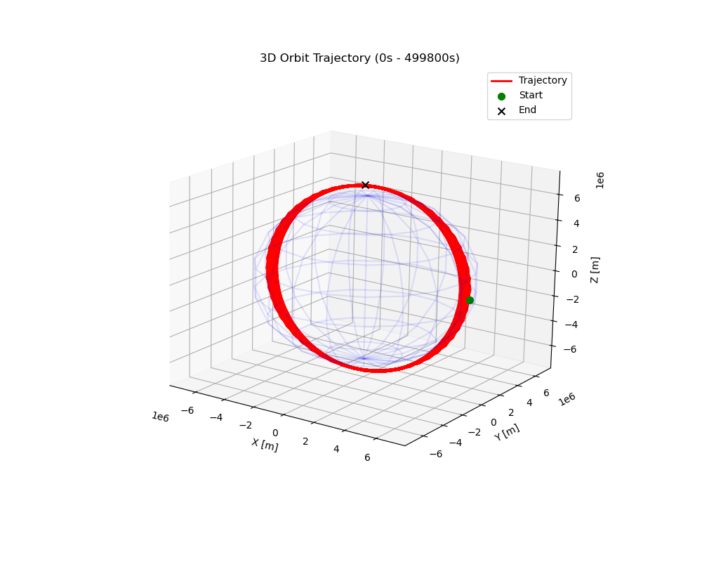
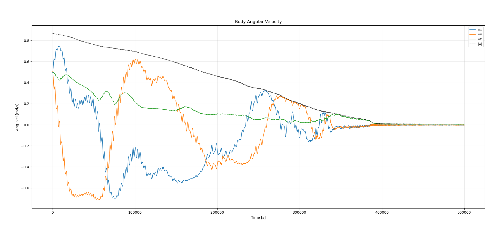
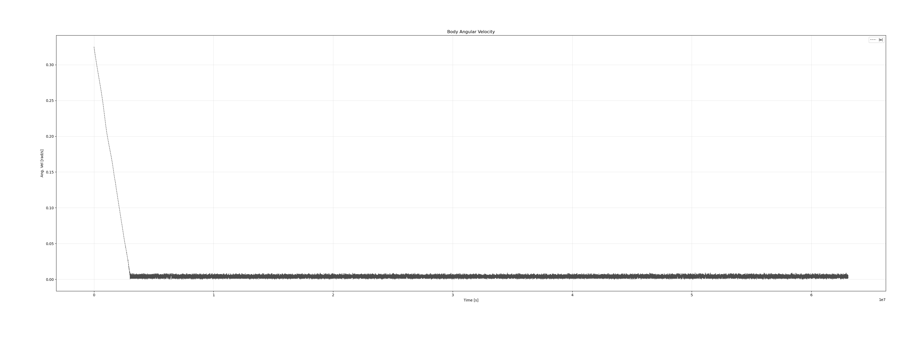
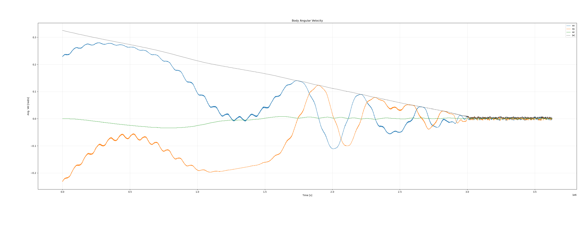
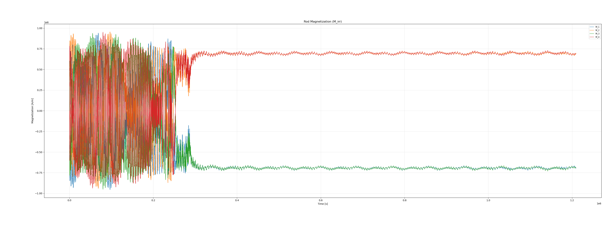
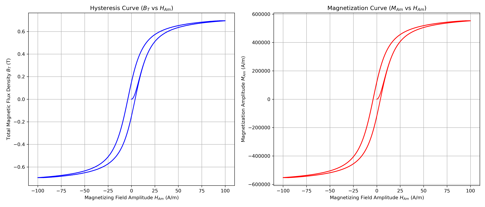

# Attitude Orbit Simulator for Passive AOCS

This project is a simulator designed to predict the attitude dynamics of a CubeSat using a passive Attitude and Orbit Control System (AOCS). It models the complex interaction between a permanent magnet, hysteresis damping rods, and the Earth's environment to simulate detumbling and magnetic stabilization in Low Earth Orbit (LEO).

## Core Physics Models

### 1. Environmental Modeling (GeographicLib)
*   **Gravity:** **EGM2008** (Earth Gravitational Model) calculates gravitational perturbations (J2, etc.).
*   **Magnetosphere:** **WMM2025** (World Magnetic Model) provides the precise magnetic field vector $\mathbf{B}(t, \mathbf{r})$ at the satellite's specific geodetic location and epoch.

### 2. Rotational Dynamics
The angular acceleration is driven by external torques balanced against the spacecraft's inertia and gyroscopic coupling:

$$
\frac{d\boldsymbol{\omega}}{dt} = \mathbf{I}^{-1} \left[ \mathbf{m}_p \times \mathbf{B}_{body} + \sum_{i=1}^{N} \mathbf{T}_{h,i} + \boldsymbol{\tau}_{grav} - \boldsymbol{\omega} \times (\mathbf{I}\boldsymbol{\omega}) \right]
$$

### 3. Hysteresis Damping (Jiles–Atherton)
Passive damping is achieved via soft magnetic rods that dissipate energy through magnetic hysteresis. This is modeled using the **Jiles–Atherton** differential equation. The solver computes the time derivative of magnetization $\dot{M}$ by applying the chain rule to the field variations experienced by the tumbling craft:

$$
\frac{dM}{dt} = \frac{dM}{dH} \cdot \left( \frac{d\mathbf{B}_{body}}{dt} \cdot \frac{\mathbf{u}_{rod}}{\mu_0} \right)
$$

## Results

### Orbit Visualization
Validation of the orbital propagator using EGM2008 gravity (Degree 12).

### Detumbling Phase (First 2 Weeks)

> NOTE: This is different simulation

The initial high angular velocity (tumble) is dissipated by the hysteresis rods. The "envelope decay" behavior is clearly visible as energy is removed from the system.

### Magnetic Lock (2 Year Overview)
Over the full mission duration, the satellite settles into a magnetic lock (oscillating at $2\times$ orbital rate). The "Settling Time" for this configuration was approximately **4.8 weeks**.

#### Detumbling Phase (First 6 weeks)

### Magnetization Dynamics
The internal state of the hysteresis rods ($M$) responding to the changing $B$-field in the body frame during the detumbling phase.

### Material Characterization
Verification of the Jiles-Atherton implementation for **HyMu-80 Permalloy**. This curve validates that the rods saturate correctly ($\approx 600,000$ A/m) and exhibit the expected coercivity.

## Dependencies

*   **C++20** compliant compiler
*   **Boost** (ODEint)
*   **Eigen3** (Linear Algebra)
*   **GeographicLib** (Gravity and Magnetic field models)
*   **tomlplusplus** (TOML Parser)
